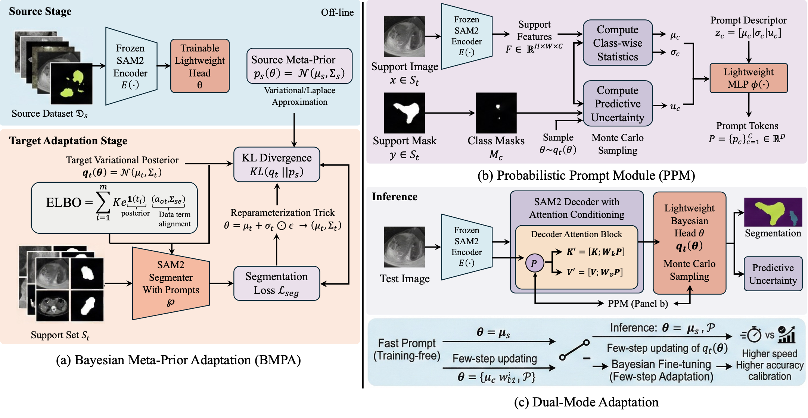

<div align="center">

# BayesPrompt: Uncertainty-Aware Bayesian Prompt Adaptation for Robust Cross-Modality Medical Segmentation

[](https://www.python.org/)
[](https://pytorch.org/)
[](https://github.com/facebookresearch/segment-anything-2)
[](https://miccai.org/)
[](LICENSE)

*A probabilistic framework leveraging foundation models for robust, few-shot domain adaptation in medical imaging.*

Initial source code is available. Verified reproduction configs, logs, and extended materials are being organized for release.



</div>

---

## 1. Method Overview
BayesPrompt is a Bayesian prompt-adaptation framework for few-shot cross-modality medical image segmentation based on Segment Anything 2 (SAM2). It is primarily a few-shot support-based adaptation method rather than a fully zero-shot model, combining the following key components:

### Bayesian Meta-Prior Adaptation (BMPA)
- The SAM2 encoder is frozen during adaptation; optimization is restricted to lightweight decoder/head parameters.
- After source training, a source-informed Gaussian prior $p_s(\theta) = \mathcal{N}(\mu_s, \Sigma_s)$ is estimated.
- During target adaptation, the target posterior $q_t(\theta) = \mathcal{N}(\mu_t, \Sigma_t)$ is regularized via a KL term to prevent overfitting:
  $$\mathcal{L}_{\text{BMPA}} = \mathbb{E}_{\theta \sim q_t} [\mathcal{L}_{\text{seg}}(\mathcal{S}_t; \theta, P)] + \lambda_{\text{KL}} D_{\text{KL}}(q_t \| p_s)$$
  where $\theta = \mu_t + \sigma_t \odot \epsilon$ via the Reparameterization Trick.

### Probabilistic Prompt Module (PPM)
- Constructs support-derived prompt tokens using class-wise feature prototypes, intra-class variance, and predictive uncertainty from target support samples:
  $$z_c = [\mu_c \,\|\, \sigma_c^2 \,\|\, u_c] \quad \longrightarrow \quad p_c = \phi(z_c)$$
- Prompt tokens are injected into decoder attention with an uncertainty reliability weight $w_c = \exp(-\alpha u_c)$ to condition the frozen features on target statistics.

### Dual-Mode Adaptation
- **Fast Prompt mode:** Gradient-free inference using the source posterior mean and support-derived prompts. (Not fully zero-shot as it depends on target support statistics).
- **Bayesian Fine-tuning mode:** Few-step target adaptation of lightweight parameters using posterior sampling.

---

## 2. Reproducibility & Hyperparameters
For comprehensive reproduction instructions, see the [Reproducibility Guide](docs/REPRODUCIBILITY.md).

- **Encoder Constraint:** SAM2 encoder remains completely frozen.
- **Trainable Parameters:** Segmentation head, final decoder block, and prompt MLPs (<6% of total parameters).
- **Optimizer & LR:** AdamW, learning rate $1\times 10^{-4}$.
- **Source Training:** 100 epochs (input size $512 \times 512$). *(Note: Example configuration files default to 5 epochs for quick validation/smoke testing. For paper-level reproduction, set `training.source_epochs=100`.)*
- **Target Adaptation:** Fixed at 20 iterations for low-shot settings ($k \in \{1, 3, 5, 10\}$) to reduce overfitting and eliminate per-dataset tuning.
- **Bayesian Sampling:** $R=4$ during adaptation, $R=8$ during inference.
- **Evaluation Protocol:** Evaluated across 5 random support runs; reporting mean $\pm$ 95% confidence intervals on Dice, IoU, and Expected Calibration Error (ECE).

---

## 3. Dataset Protocol
For dataset folder structure and details, see the [Dataset Guide](docs/DATASETS.md).

- **Public Benchmarks:** AMOS (CT/MRI abdominal multi-organ) and BraTS (MRI sequence). Cross-modality transfer is simulated by training on one modality and adapting to another using strict patient-level splits to prevent leakage.
- **Internal Dataset:** Rotator cuff tear dataset featuring ultrasound (US) and MRI subjects for supraspinatus tendon tear region segmentation. Clinician-annotated and anonymized; private and cannot be redistributed.

---

## 4. Baseline Classification & Setup
For the full status and mapping of each baseline, see the [Baseline Groups Guide](docs/BASELINES.md).

- **General Segmentation:** U-Net, nnU-Net, SegFormer.
- **SAM/Prompt Adaptation:** SAM2 Fine-tune, MedSAM, SAM-Adapter / Medical SAM Adapter, Prompt-only, and *MedSAM-U* (external).
- **Domain Adaptation:** *VP-SFDA* (external), *MAUP* (external).
- **Reporting Scope:** Baselines are separated by evaluation focus (Main Dice table, Component Ablation, Calibration/Stability table) rather than showing all baselines in every table.

---

## 5. Calibration, Stability & Efficiency
- **Calibration (ECE):** Evaluates Expected Calibration Error. Bayesian Fine-tuning and uncertainty-aware prompting consistently improve calibration and predictive reliability in the reported settings compared to deterministic adaptation.
- **Ablation Studies:**
  - Removing **BMPA** causes the largest Dice degradation and higher variance.
  - Removing **PPM** reduces robustness under modality shifts.
  - Removing **uncertainty weighting** has a smaller effect on Dice but worsens ECE.
- **Parameter Efficiency:** Frozen encoder adaptation is highly efficient, though extreme modality shifts can still challenge the frozen representations (partially mitigated by PPM/BMPA).


<details>
<summary>Extended calibration and stability results</summary>

Extended calibration and stability comparison on AMOS and the internal rotator cuff tear (RCT) dataset. Values are mean ± 95% CI. Dice is reported for k=1 and k=3, and ECE is reported for k=3. Lower ECE indicates better calibration.

| Dataset | Direction | Method | Dice (k=1) ↑ | Dice (k=3) ↑ | ECE (k=3) ↓ |
| :--- | :--- | :--- | :--- | :--- | :--- |
| AMOS | CT→MRI | U-Net | 55.3±3.4 | 66.8±2.9 | 9.1%±1.4 |
| AMOS | CT→MRI | nnU-Net | 58.4±3.2 | 69.6±2.7 | 8.6%±1.3 |
| AMOS | CT→MRI | SegFormer | 57.9±3.1 | 69.2±2.6 | 8.4%±1.3 |
| AMOS | CT→MRI | CDUN | 60.7±2.9 | 72.1±2.4 | 7.8%±1.2 |
| AMOS | CT→MRI | SAM2 zero-shot | 58.6±2.9 | 58.6±2.9 | 10.2%±1.5 |
| AMOS | CT→MRI | SAM2 Fine-tune | 65.7±2.7 | 74.8±2.2 | 7.2%±1.1 |
| AMOS | CT→MRI | MedSAM | 61.3±2.8 | 70.4±2.4 | 8.0%±1.2 |
| AMOS | CT→MRI | SAM-Adapter | 64.5±2.6 | 73.9±2.2 | 7.1%±1.1 |
| AMOS | CT→MRI | SAM Few-shot | 66.2±2.5 | 75.4±2.1 | 6.9%±1.0 |
| AMOS | CT→MRI | VP-SFDA | 67.4±2.4 | 76.8±2.0 | 6.3%±1.0 |
| AMOS | CT→MRI | MAUP | 68.9±2.3 | 78.1±1.9 | 6.0%±0.9 |
| AMOS | CT→MRI | MedSAM-U | 70.4±2.2 | 80.2±1.8 | 6.8%±1.1 |
| AMOS | CT→MRI | Prompt-only | 67.1±2.4 | 76.5±2.0 | 5.6%±0.9 |
| AMOS | CT→MRI | **BayesPrompt** | **74.8±1.9** | **84.5±1.5** | **2.9%±0.6** |
| AMOS | MRI→CT | U-Net | 58.1±3.1 | 69.3±2.6 | 8.7%±1.3 |
| AMOS | MRI→CT | nnU-Net | 61.2±2.9 | 72.4±2.4 | 8.1%±1.2 |
| AMOS | MRI→CT | SegFormer | 60.3±2.9 | 71.5±2.4 | 8.1%±1.2 |
| AMOS | MRI→CT | CDUN | 63.5±2.6 | 74.6±2.1 | 7.3%±1.1 |
| AMOS | MRI→CT | SAM2 zero-shot | 61.7±2.7 | 61.7±2.7 | 9.5%±1.4 |
| AMOS | MRI→CT | SAM2 Fine-tune | 70.8±2.3 | 79.9±2.0 | 6.7%±1.0 |
| AMOS | MRI→CT | MedSAM | 63.7±2.6 | 72.5±2.2 | 7.6%±1.1 |
| AMOS | MRI→CT | SAM-Adapter | 67.1±2.4 | 76.3±2.0 | 6.8%±1.0 |
| AMOS | MRI→CT | SAM Few-shot | 69.4±2.2 | 78.2±1.9 | 6.4%±0.9 |
| AMOS | MRI→CT | VP-SFDA | 70.8±2.1 | 79.6±1.8 | 5.9%±0.9 |
| AMOS | MRI→CT | MAUP | 72.4±2.0 | 81.0±1.7 | 5.6%±0.8 |
| AMOS | MRI→CT | MedSAM-U | 74.6±1.9 | 83.4±1.6 | 5.9%±0.9 |
| AMOS | MRI→CT | Prompt-only | 72.9±2.1 | 81.6±1.8 | 5.2%±0.8 |
| AMOS | MRI→CT | **BayesPrompt** | **78.6±1.6** | **87.2±1.3** | **2.6%±0.5** |
| RCT | US→MRI | U-Net | 44.2±4.1 | 55.8±3.5 | 10.4%±1.6 |
| RCT | US→MRI | nnU-Net | 50.1±3.7 | 62.9±3.1 | 9.4%±1.4 |
| RCT | US→MRI | SegFormer | 52.4±3.4 | 64.5±2.9 | 8.9%±1.4 |
| RCT | US→MRI | CDUN | 55.6±3.2 | 67.9±2.7 | 8.2%±1.3 |
| RCT | US→MRI | SAM2 zero-shot | 50.6±3.6 | 50.6±3.6 | 11.3%±1.7 |
| RCT | US→MRI | SAM2 Fine-tune | 58.1±6.3 | 69.7±4.9 | 7.4%±1.2 |
| RCT | US→MRI | MedSAM | 57.6±3.1 | 66.3±2.7 | 8.2%±1.3 |
| RCT | US→MRI | SAM-Adapter | 60.2±2.9 | 69.8±2.4 | 7.5%±1.1 |
| RCT | US→MRI | SAM Few-shot | 61.7±2.8 | 71.2±2.3 | 7.2%±1.1 |
| RCT | US→MRI | VP-SFDA | 62.5±2.7 | 72.6±2.2 | 6.6%±1.0 |
| RCT | US→MRI | MAUP | 63.4±2.6 | 73.8±2.1 | 6.2%±0.9 |
| RCT | US→MRI | MedSAM-U | 63.8±4.8 | 75.9±3.6 | 6.8%±1.1 |
| RCT | US→MRI | Prompt-only | 60.4±5.1 | 72.1±4.2 | 5.9%±0.9 |
| RCT | US→MRI | **BayesPrompt** | **64.2±3.8** | **76.8±2.9** | **2.9%±0.6** |
| RCT | MRI→US | U-Net | 52.6±3.8 | 63.9±3.1 | 9.6%±1.5 |
| RCT | MRI→US | nnU-Net | 58.3±3.2 | 70.4±2.6 | 8.6%±1.3 |
| RCT | MRI→US | SegFormer | 60.7±2.8 | 72.9±2.3 | 8.0%±1.2 |
| RCT | MRI→US | CDUN | 63.8±2.6 | 75.4±2.1 | 7.4%±1.1 |
| RCT | MRI→US | SAM2 zero-shot | 57.9±3.2 | 57.9±3.2 | 10.1%±1.5 |
| RCT | MRI→US | SAM2 Fine-tune | 62.4±5.8 | 73.1±4.2 | 6.9%±1.1 |
| RCT | MRI→US | MedSAM | 65.2±2.7 | 74.8±2.2 | 7.4%±1.1 |
| RCT | MRI→US | SAM-Adapter | 68.7±2.4 | 77.6±2.0 | 6.6%±1.0 |
| RCT | MRI→US | SAM Few-shot | 69.1±2.4 | 78.2±2.0 | 6.3%±0.9 |
| RCT | MRI→US | VP-SFDA | 71.1±2.2 | 79.6±1.8 | 5.8%±0.9 |
| RCT | MRI→US | MAUP | 72.6±2.2 | 81.5±1.8 | 5.4%±0.8 |
| RCT | MRI→US | MedSAM-U | 70.2±4.1 | 80.5±3.2 | 5.7%±1.0 |
| RCT | MRI→US | Prompt-only | 68.5±4.5 | 78.4±3.5 | 5.1%±0.9 |
| RCT | MRI→US | **BayesPrompt** | **75.9±3.2** | **83.8±2.6** | **2.4%±0.5** |

</details>


---

## 6. Limitations and Future Work
- **Few-Shot Boundary:** Designed for few-shot support-based adaptation, not fully unsupervised zero-shot deployment. Fast Prompt still requires support annotations.
- **Unlabeled Target Samples:** The current framework does not exploit abundant unlabeled target data. Leveraging unlabeled target samples (e.g., self-training, contrastive alignment) is left as future work.
- **Suboptimal Encoder Features:** Extremely severe modality shifts may exceed the capacity of frozen foundation representations.
- **Clinical Data Release:** Internal clinical datasets are private and cannot be redistributed.

---

## 7. Repository Structure
```text
bayesprompt/
├── configs/            # YAML configs for datasets, models, and training
├── core/               # Registry, config loaders, and decorators
├── datasets/           # PyTorch Dataset definitions (AMOS, BraTS, RotatorCuff)
├── evaluation/         # Dice/IoU/ECE Evaluator and LaTeX Table Builder
├── experiments/        # Experiment runners (crossmod, ablate, visualize)
├── losses/             # BMPALoss, Calibration ECE
├── models/             # BayesPrompt, UNet, nnUNet, MedSAM, CDUN, SAM-Adapter
├── training/           # SourceTrainer and TargetAdapter
└── assets/             # Figures and README assets
```

---

## 8. Installation & Quickstart

```bash
# 1. Clone repository
git clone https://github.com/Macs-Laboratory/bayesprompt.git
cd bayesprompt

# 2. Setup Conda Environment
conda create -n bayesprompt python=3.10 -y
conda activate bayesprompt

# 3. Install Dependencies
pip install -r requirements.txt

# 4. (Optional) Install official SAM2 if running real checkpoints
git clone https://github.com/facebookresearch/segment-anything-2.git
cd segment-anything-2
pip install -e .
cd ..
```

To run the experiments on actual medical datasets, configure the data paths and execute the main pipeline:
```bash
python main.py train --config bayesprompt/configs/external_ct_mri.yaml dataset.source_modality=CT
python main.py adapt --config bayesprompt/configs/external_ct_mri.yaml dataset.source_modality=CT dataset.target_modality=MRI fewshot.k=3
python main.py crossmod --config bayesprompt/configs/external_ct_mri.yaml
python main.py ablate --config bayesprompt/configs/internal_us_mri.yaml fewshot.k=3
python main.py eval --config bayesprompt/configs/external_ct_mri.yaml
python main.py visualize --config bayesprompt/configs/internal_us_mri.yaml
python main.py reproduce --config bayesprompt/configs/external_ct_mri.yaml
```

---

## 9. Generated Outputs & Result Tables

### Result Tables
- `table_crossmod_dice.tex`: Cross-modality Dice results for CT->MRI, MRI->CT, US->MRI, and MRI->US across $k \in \{1,3,5,10\}$.
- `table_ablation.tex`: Component ablation results for US->MRI and MRI->US.
- `table_calibration_stability.tex`: Dice/ECE stability summary.
- `table_efficiency.tex`: Parameter-efficiency profiling table.

*(Note: Parameter-efficiency, iteration-sensitivity, and other optional analytical outputs are produced only by their corresponding runners).*

### Output Directory Structure
```text
outputs/
  experiment_name/
    ablation/
      metrics_per_seed.csv (Raw Seed Data)
      summary.json
    crossmod/
      metrics_per_seed.csv (Raw Seed Data)
      summary.json
    tables/
      table1_crossmodality.tex
      table2_calibration_stability.tex
      table3_ablation.tex
      table_efficiency.tex
    figures/
      qualitative_grid.png
      reliability_diagram.png
      iteration_sensitivity.png
    metrics/
      iteration_sensitivity.csv
```

---

## 10. Reproducibility Checklist
- [x] All 5 random seeds fixed for reproducibility.
- [x] Support IDs dynamically saved preventing train/evaluation leakage.
- [x] Flat metric schema enforced (`dice_ci95`, `ece`).
- [x] True raw `metrics_per_seed.csv` tracking.

---

## 11. Troubleshooting and FAQs
- **`KeyError: 'dice_mean'`:** Ensure you are using the latest flat schema output from `ExperimentRunner.run()`.
- **Missing Checkpoints:** If `sam2_hiera_large.pt` is missing, real mode will crash. Download the official SAM2 checkpoint and set `model.sam2_checkpoint` in the corresponding config.
- **Slow Inference:** `adaptation.mc_samples_eval=8` by default. For faster exploratory runs, set `adaptation.mc_samples_eval=1`.

---

## 12. Citation
```bibtex
@inproceedings{hong2026bayesprompt,
  title={Uncertainty-Aware Bayesian Prompt Adaptation for Robust Cross-Modality Medical Segmentation},
  author={Hong, SaKang and Kim, Jun-Young and Lee, Kyungsu},
  booktitle={International Conference on Medical Image Computing and Computer-Assisted Intervention},
  year={2026}
}
```
